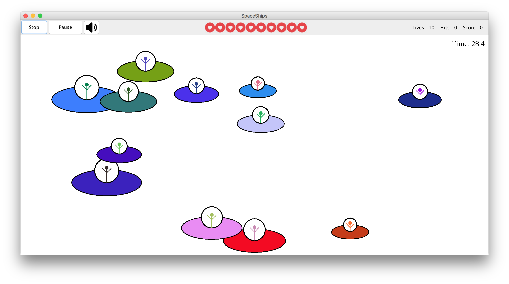
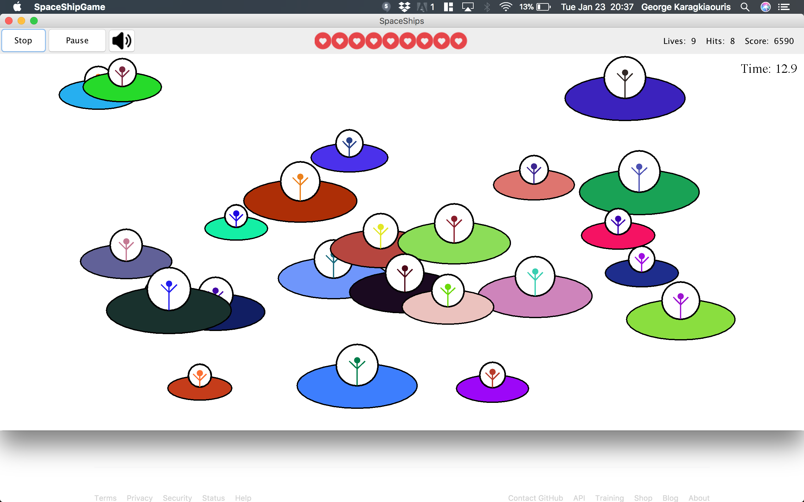
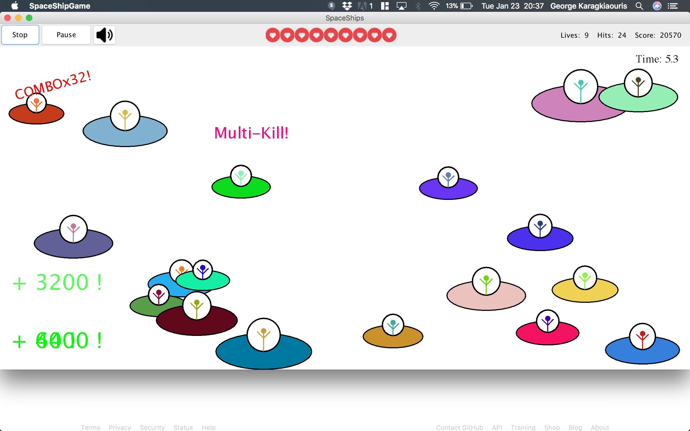

# SpaceShips
A SpaceShip shooting game written in Java using Swing and awt

## Installation 
```
javac *.java
java SpaceShipGame
```

## Goal
Shoot down the Space Ships without missing shots. Missing a shot will lose a life. Shoot multiple ships together or within a short interval to get extra points

## Controls
- Use the cursor to aim
- Left click to shoot
- Pause/Stop/Restart/Mute the game using the control panel

## Screenshots



